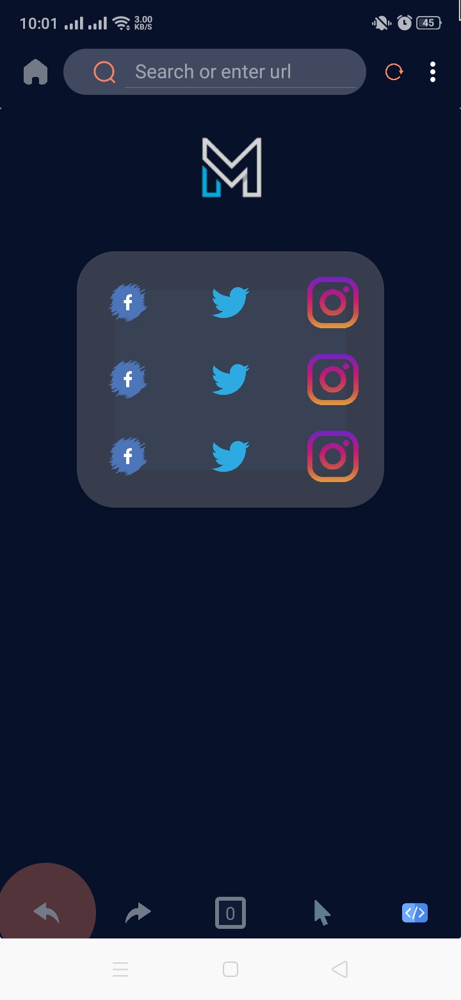
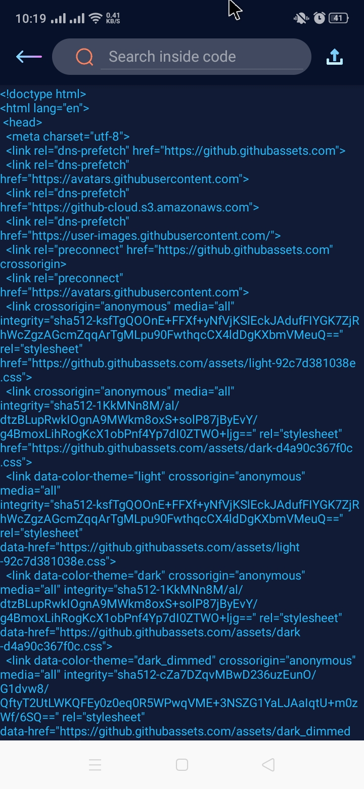

# Meta-Browser
Meta Browser is an app build for experimental or testing purpose to give ability to the user of editing source code

Here is some screenshot.
  
Download it from release [page ->](https://github.com/azclub-ltd/Meta-Browser/releases/tag/Meta-Browser-experimental)

### What it can do:-
- [x] It can browse url]
- [x] It can edit source code
- [x] Go Forward, Backward
- [x] Reload web page

### What it can't do:-
- [ ] Open Multiple tabs
- [ ] Search inside source editor
- [ ] Advance browser job
